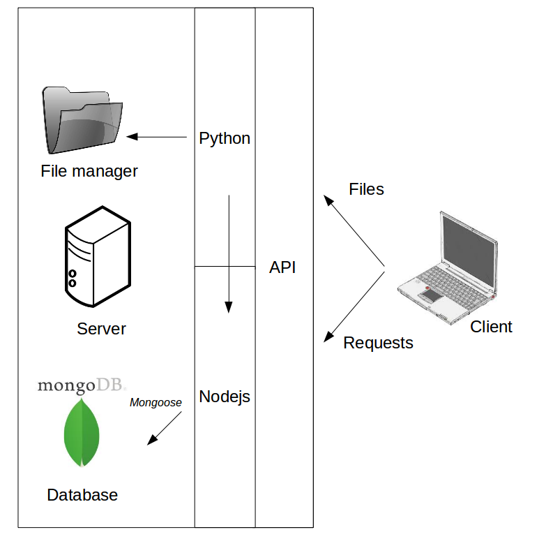

# Retina API

## UAV Retina project 

A high-tech semi-autonomous drone that might save lives

Supported by EIT Digital, UAV Retina is an all-in-one software and hardware platform developed by researchers of université de Rennes 1, developing semi-autonomous drones able to analyse data collected with sensors, in order to provide emergency services with a general overview of a scene, and detect potential victims.

See [Eole Eyes](http://eole-eyes.irisa.fr/) website for further information.

## Architecture

This repository contains an interface to request a mongo database, implemented in node.js.

- In the data_models folder: every data schema and model
- In the doc folder ; data models' documentation, samples and examples
- In the main folder: the launcher (main.js) and the express routing
- In the samples folder: some examples to play with mongo
- In the python folder: python scripts to send and receive files or request the api
- In the file manager folder: send or receive file with nodejs

## Install

You will need mongoDB to store your data, follow this [tutorial](https://hevodata.com/blog/install-mongodb-on-ubuntu/).

In order to launch the python scripts, you should install python3 and additional libraries (json, requests, socket, threading, time) on your server.

To install this API, clone this repository:

<code>git clone https://github.com/llesoil/retina_api</code>

Go in the retina_api folder:

<code>cd retina_api</code>

Install npm and nodejs;

<code>sudo apt-get update</code>

<code>sudo apt-get install nodejs</code>

<code>sudo apt-get install npm</code>

Install other nodejs dependencies:

<code>npm install</code>

If you have issues with the fs requirement, just run:

<code>npm install fs</code>

## Usage

To run the API, just launch the main.js file of the main directory:

<code>node ./main/main.js</code>

### Load some examples in the database

In the main.js file, uncomment the 18th line before launching the application;

<code>require('../doc/data.js').load_examples();</code>

To check if the data is loaded on your mongo database, just download [Robo3T](https://robomongo.org/)

Open a Robo3T window, and create a mongoDB connection; fill ip with 127.0.0.1 or localhost and port with 27017

You should see a database named retina, with 8 collections.

### Request the API

To request your API, you should download [postman](https://www.getpostman.com/). It allows you to request URLs

Each line is a request, respecting the same structure : type of request, URL, Body.
If the request body is missing, you don't have to fill the body, just leave it empty

- Get all the interventions:

get, http://127.0.0.1:1337/intervention/

- Get all the interventions between two gps coordinates :

get, http://127.0.0.1:1337/intervention/gps_time=48.353179;-1.641688;48.602724;-1.640057

- Get all the interventions between two gps coordinates and starting before+ending after a specific time

get, http://127.0.0.1:1337/intervention/gps_time=48.353179;-1.641688;48.602724;-1.640057;2019-05-02T17:40:00,000+02:00

You can send a get request with a body. For an example, a body filled with {"quality" : 2} will return all the intervention with the quality field equal to 2

- Get the missions

get, http://127.0.0.1:1337/mission/

- Add a waypoint

post, http://127.0.0.1:1337/waypoint/, {"battery_level" : 80.5,
		"waypoint_location" : {"altitude" : 15.321,
			"latitude" : 48.452666, 
			"longitude" : -1.6406852},
			"end_pose_time" : "2019-05-02T17:05:32,854+02:00",
			"quality" : 2,
			"arrival_time" : "2019-05-02T17:05:24,413+02:00",
			"temperature" : 14.3,
			"wind_direction" : 320.4,
			"wind_strength" : 25}
		
- Add a mission

post, http://127.0.0.1:1337/mission/, {"was_changed" : false,
		"comments" : "Third goal far from the original objective",
		"mission_end_time" : "2019-05-02T17:05:56,000+02:00",
		"was_finished" : false,
		"moving_duration" : "P0Y0M0DT0H19M53,254S",
		"payload_weight" : 2.3,
		"pilot_name" : "Olivier",
		"quality" : 3,
		"scenario" : "S2",
		"mission_start_time" : "2019-05-02T16:36:52,154+02:00",
		"type_of_mission" : "building recognition"}

- The previous request should have added a mission. Now you should see two missions in the response.

get, http://127.0.0.1:1337/mission/

- But the second one is false. If we want to delete it:

delete, http://127.0.0.1:1337/mission/scenario=S2

- On the first mission, the pilot was Vincent and not Olivier, I have to patch
it. Replace x with the id of the mission you get on the last response like 5d5b1f11987c1e1d44def65b for an example

patch, http://127.0.0.1:1337/mission/id=x, {"pilot_name":"Vincent"}